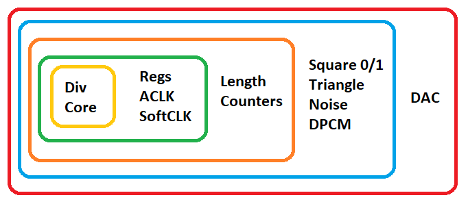

# APUSim

APU simulator at the gate level.

Note: In the Breaks project, the term APU refers to the entire CPU chip (2A03/2A07), which includes the 6502 core and the APU itself. Therefore, here APU and CPU are synonymous.

## Simulation Approaches

In general, all approaches are tried on the M6502Core, in terms of APU nothing particularly new. We take the circuit and repeat its work in C++. In the beginning somehow, and then we try to optimize it.

All of the APU schematics can be found here: https://github.com/emu-russia/breaks/tree/master/BreakingNESWiki_DeepL/APU

To simplify understanding, the following image shows the "layers" in which the individual parts of the APU are simulated:

