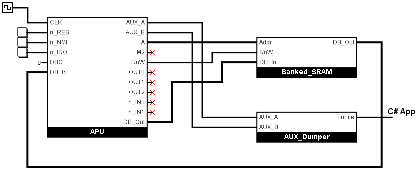

# NSF Player

A simple player of NSF files, for checking the APU simulation.

NSF format description: https://www.nesdev.org/wiki/NSF

NSF features that require extended support for different chips and architectures are not supported:
- FDS Bankswitching
- Sound Chip Support
- NSF extension (NSFe, NSF2)

The most confusing thing about the NSF format is the presence of NTSC/PAL entities in the header, which are generally speaking related to the video part and have nothing to do with the APU (sound).
