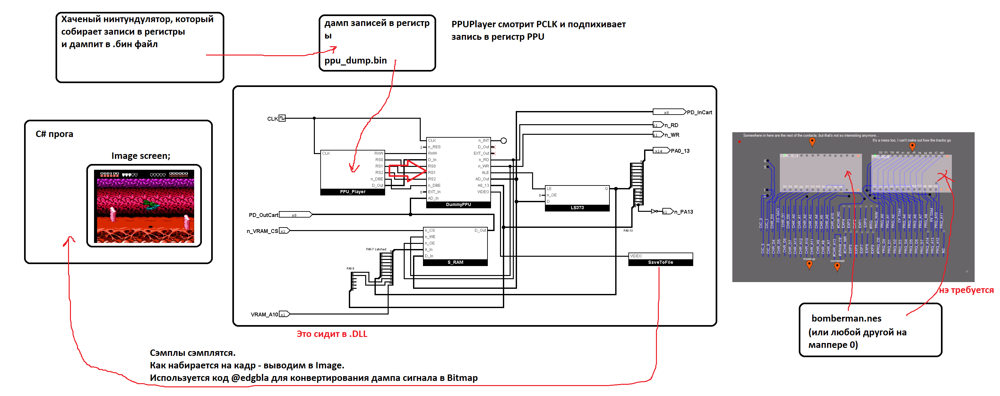

# PPU Player

Workflow:

Nintendulator + PPU Recorder: https://github.com/ogamespec/nintendulator/releases/tag/ppu-recorder

## CPU I/F Timing

This section describes when (and for how long) to use the CPU I/F PPU to write the register.

No 6502 instruction can technically execute faster than a single PCLK.

So we will make the assumption that the CPU I/F (signal `/DBE` and others) will be active for the entire PCLK cycle (`/PCLK` + `PCLK`).

If this does not work, we will do some more research on how to do it better.
