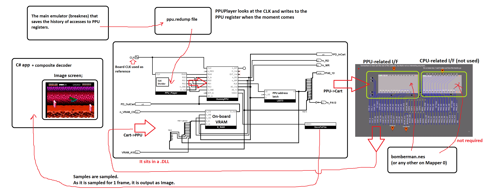
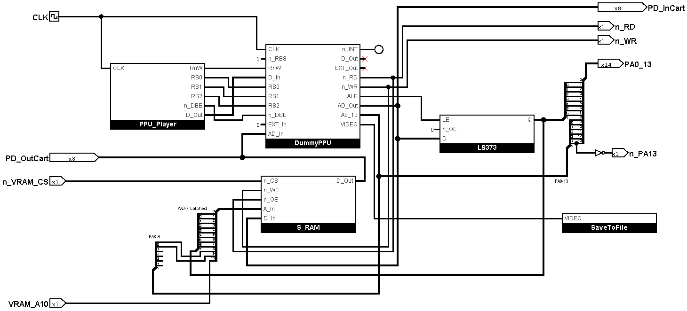

# PPU Player

Workflow:

## How to get PPU register dumps

Use the special version of Nintendulator + PPU Recorder to dump CPU accesses to the PPU registers: https://github.com/ogamespec/nintendulator/releases/  (get latest)

Run the PPU Recorder BEFORE starting the ROM, otherwise some of the PPU register operations will "slip past" the register dump file.

Note that you have to run the simulation in the PPU Player with the same .nes as when writing the dump in the Nintendulator. Or not :smiley:

## CPU I/F Timing

This section describes when (and for how long) to use the CPU I/F to read/write the PPU register.

No 6502 load/store instruction can technically execute faster than a single PCLK.

So we will make the assumption that the CPU I/F (signal `/DBE` and others) will be active for the entire PCLK cycle (`/PCLK` + `PCLK`).

If this does not work, we will do some more research on how to do it better.

EDIT: The assumption is correct, it is a working model, you can safely use it.
