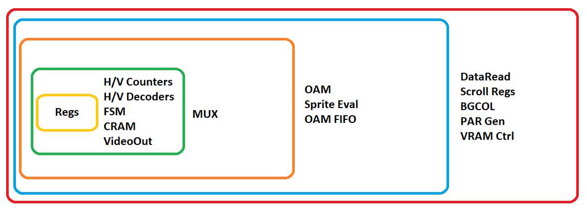

# PPUSim

PPU simulator at the gate level.

## Simulation Approaches

In general, all approaches are tried on the M6502Core, in terms of PPU nothing particularly new. We take the circuit and repeat its work in C++. In the beginning somehow, and then we try to optimize it.

All of the PPU schematics can be found here: https://github.com/emu-russia/breaks/tree/master/BreakingNESWiki_DeepL/PPU

To simplify understanding, the following image shows the "layers" in which the individual parts of the PPU are simulated:

