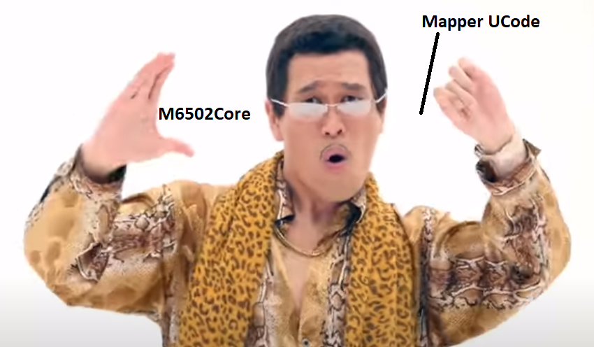
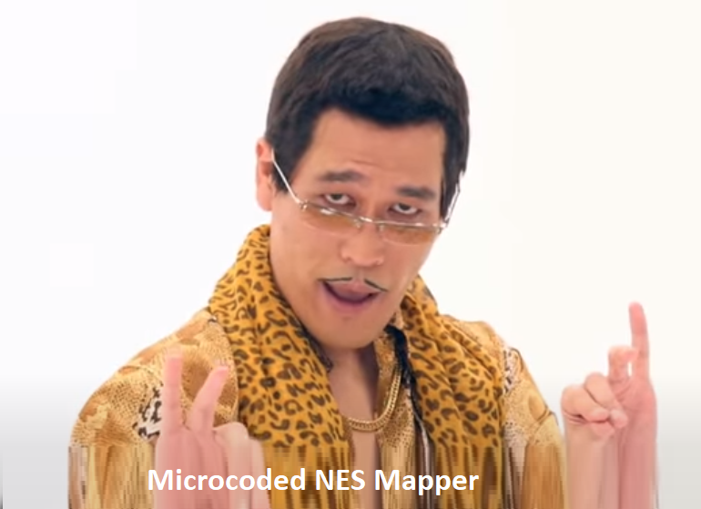

# Mappers

This component combines everything related to the cartridge port and mappers. Please treat the term "Mappers" in this context as a synonym for cartridge.

The implementation of mappers is done (in progress) in two ways:
- Generic simulation of common mapper circuits in C++ using BaseLogicLib
- Ability to simulate unusual mappers using 6502 microcode + JSON meta

## List of problem areas

List of what is currently problematic in this component:
- Support for working with memory dumps (PRG/CHR) is not very clear. The CHR region has been called "CHR-ROM" since the early stages of development. PRG is not supported at all
- Emulation of .nes mappers is very chaotic, in the sense of translating the mapper number into cartridge board components. This is further complicated by the fact that the same mapper (eg MMC1) can be implemented in different cartridges with a lot of variations and how to form and connect the components of the cartridge for its simulation is not very clear
- There is no support for ROM chips. Now everything is done via byte array. It is necessary to implement it by analogy with `Generic SRAM` chip in BaseBoardLib.
- MMC1 emulation requires debugging and verification. Most likely something is wrong with the divider.

## Abstract Cartridge

The emulation of mappers is based on the same principle as for the other parts of the emulator: take a device or connector, stick signals in it and something happens.

In the case of the сartridge, an "abstract port" is used which summarizes all the interfaces of the real NES/Famicom cartridge connector (sound, Expansion Port), but in a particular instance only the necessary ones are used (for example if you create a NES motherboard - there will be no sound from the cartridge).

CartridgeFactory creates a cartridge instance for the main part of the emulator based on meta-information attributes (NES header, JSONES meta-information).

## Mapper microcode

The NES/Famicom is famous for its large number of mappers. To the licensed mappers, just over-10001 Chinese mappers were added, with minimal variations, but for each you have to enter your own "number" in the .NES format.

But what if you let an advanced user speak on their own in a "cast" of roms - which mapper should be used for them. And not just what kind of mapper, but to determine the behavior of the mapper yourself.

We have:
- A collection of CHR/PRG roms, possibly cobbled together as a .nes file, or possibly just a bunch of files lying around
- Schematics of the mapper / auxiliary chips that are on the cartridge
- 6502 Emulator
- 6502 firmware that simulates cartridge pin access and implements wild mapper logic

Of course, most of the mappers are easier to simulate in C++, but for universality, let's add the ability to write simulators of our own mappers.

How it will work:
- Next to .nes or just like that lies JSON with meta information (it seems like everyone voted to call this format `JSONES`)
- The path to the .asm file with microcode is written in JSON
- Our emulator has a primitive/advanced assembler that compiles the microcode into a 64KB BLOB
- Another M6502Core instance is being created, which stupidly works with microcode and nothing else
- When the main emulator simulates a microcode cartridge port, the values of the cartridge connector signals are entered into the 6502 microcode memory and control is transferred to the microcode entry point
- The microcode simulates something there, does bbrrrr and outputs the values of the output signals of the cartridge connector to memory
- The main part of the emulator picks up signals and rejoices

More details like UCode 6502 memory map etc. in the process of implementation. You also need to figure out how the microcode will gain access to the roms (obviously, they all need to be loaded into memory first, and from the 6502 side, somehow knock there). We'll come up with something.

## Why Assembler?

The reader may have a reasonable question: why such a perverted approach (6502 assembly language microcode) is used instead of the popular scripting language (LUA, Python)?

The reasons are as follows:
- We already have a ready assembler for 6502 and an emulator. No need to drag any other dependencies into our little project.
- Scripting engines generate bytecode as a result of their activity. The assembler generates microcode as a result of its activity. In principle, there is no difference between the two.
- LUA has a wicked syntax that is not for humans.
- Python has a code base like Boeing.
- Anyone who was even faced with the torture of choosing which scripting engine to integrate into their C++ project need not read all this (but already read it)
