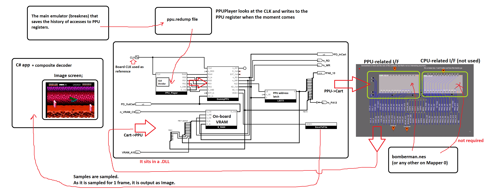
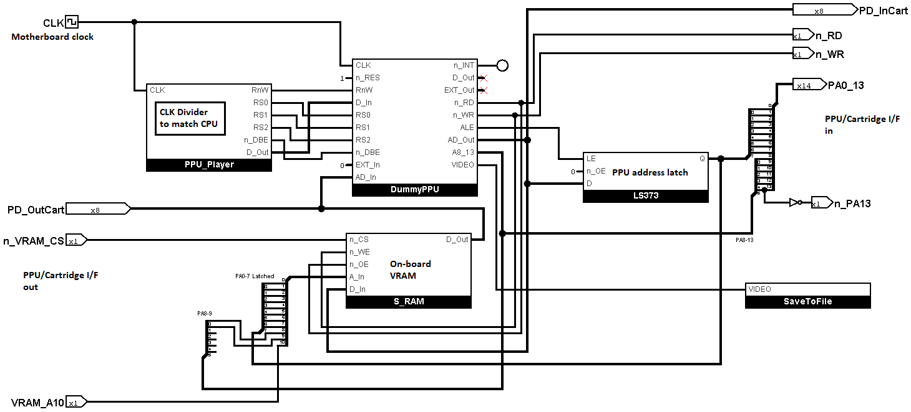

# PPU Player

Workflow:





## How to get PPU register dumps

You can use the main emulator (breaknes). In the settings you need to enable PPURegump=True and select the folder where regdump will be saved.

Don't forget to set the correct CPU divider in the PPUPlayer settings to match the CPU with which the regdump was obtained.

Regdump entries format:

```c++
#pragma pack(push, 1)
struct RegDumpEntry
{
	uint32_t	clkDelta;	// Delta of previous CLK counter (CPU Core clock cycles) value at the time of accessing to the register
	uint8_t 	reg; 		// Register index + Flag (msb - 0: write, 1: read)
	uint8_t 	value;		// Written value. Not used for reading.
	uint16_t	padding;	// Not used (yet?)
};
#pragma pack(pop)
```

## CPU I/F Timing

This section describes when (and for how long) to use the CPU I/F to read/write the PPU register.

No 6502 load/store instruction can technically execute faster than a single PCLK.

So we will make the assumption that the CPU I/F (signal `/DBE` and others) will be active for the entire PCLK cycle (`/PCLK` + `PCLK`).

If this does not work, we will do some more research on how to do it better.

EDIT: This model works if you use a correct regdump that writes to PPU registers correctly. If you write to PPU registers at the wrong moment (e.g. not during VBlank), visual artifacts may appear.
